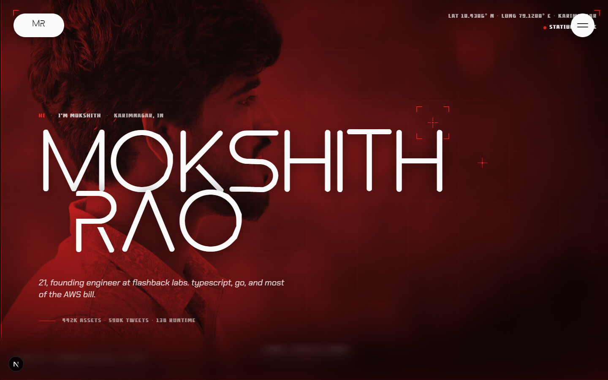
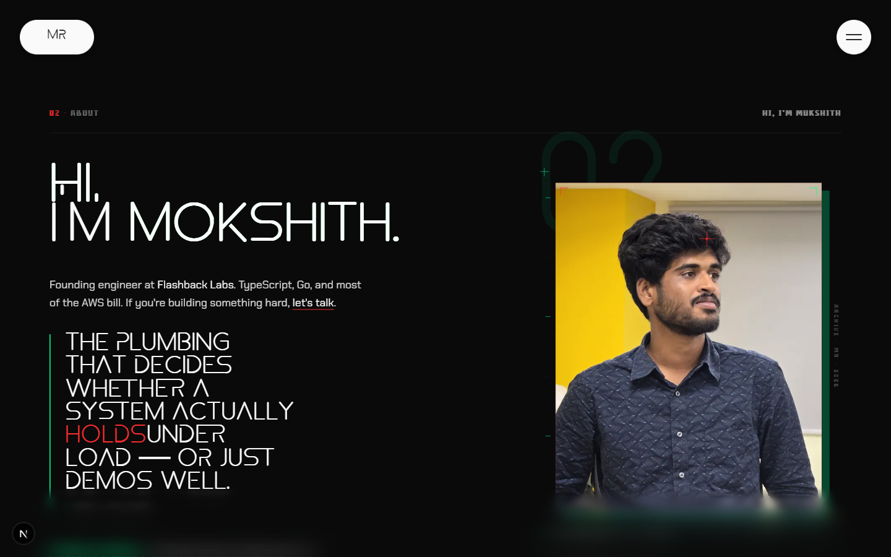
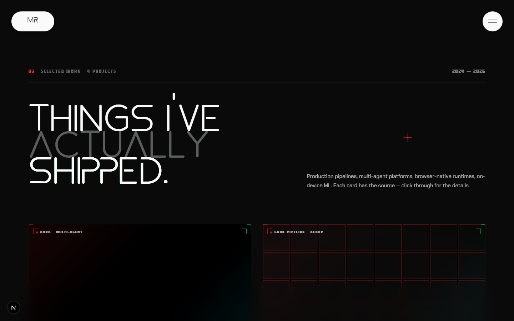
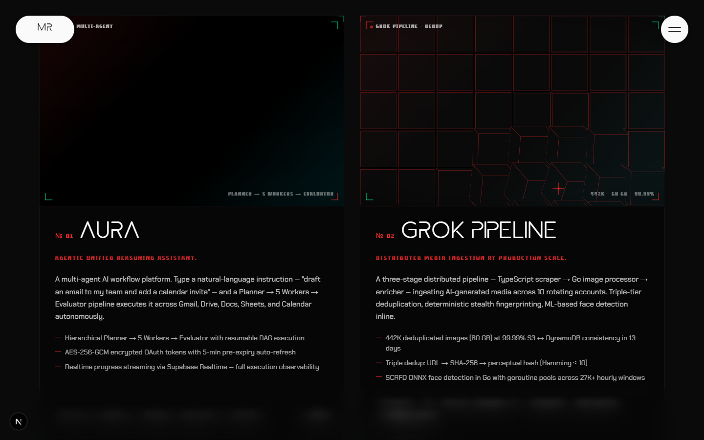
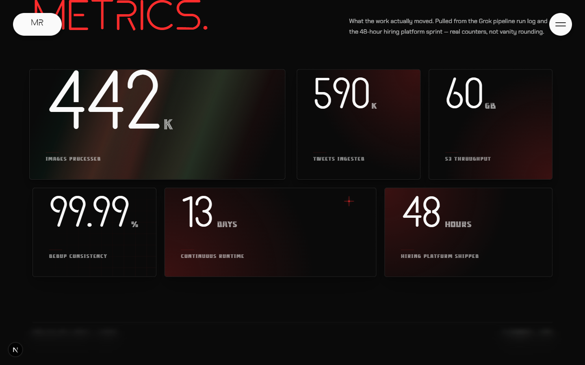
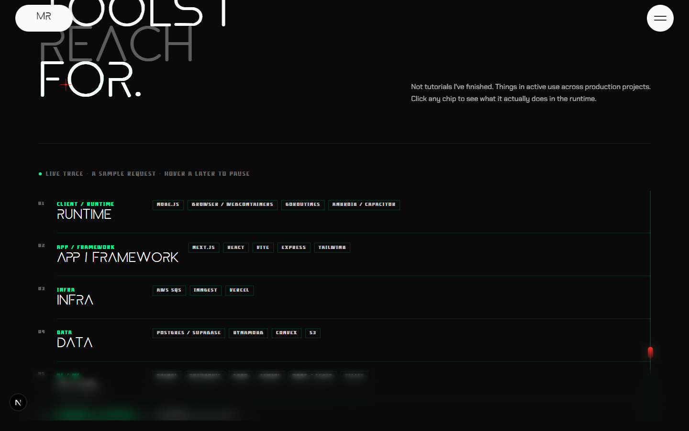
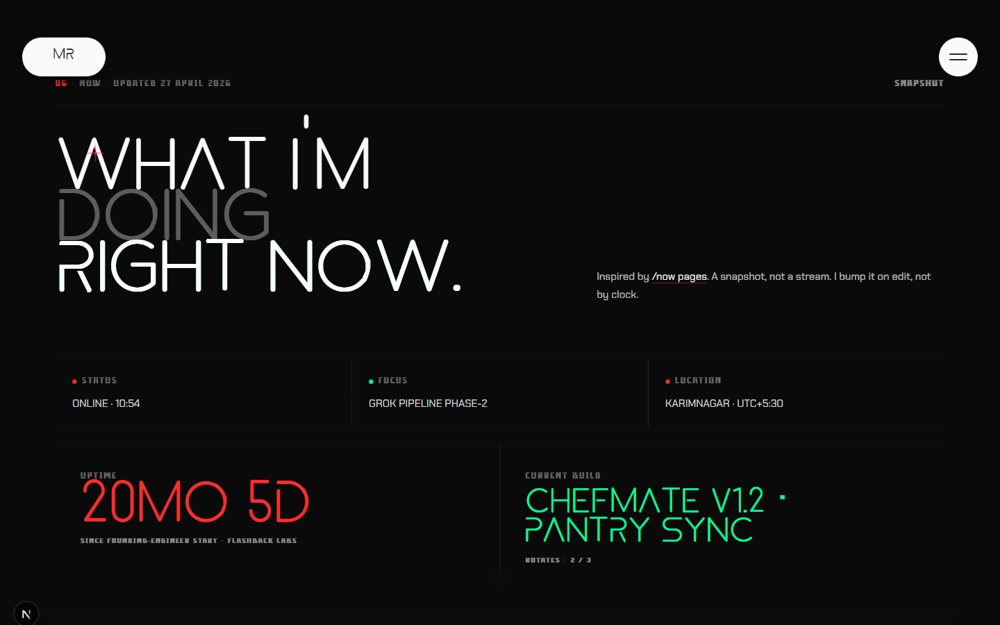
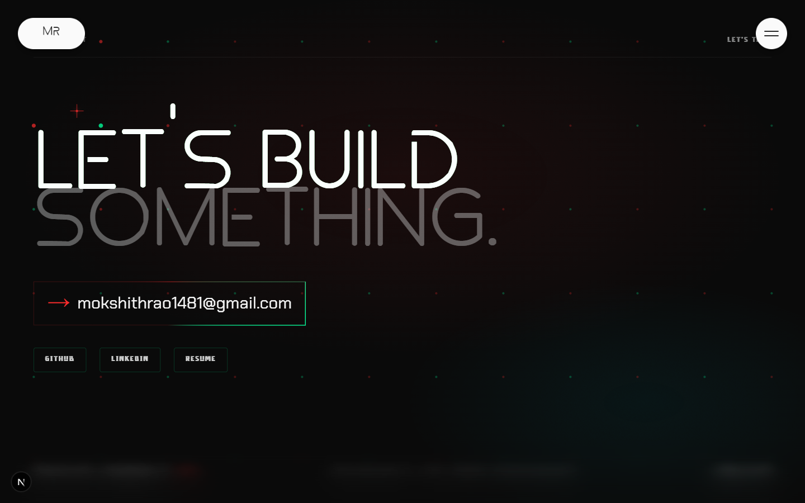

# Mokshith Rao — Portfolio

Personal site for Mokshith Rao, founding engineer at Flashback Labs. A single long-scroll page with a HUD/telemetry aesthetic — duotone hero, scroll-scrubbed type, live request trace, real production metrics from shipped pipelines.

**Live:** [mokshith.vercel.app](https://mokshith.vercel.app)

---



## Stack

- **Next.js 16** (App Router) + **React 19**
- **TypeScript**, **Tailwind CSS v4**
- **Motion** (Framer Motion successor) + **GSAP** for scroll-scrubbed timelines
- **Lenis** for smooth scroll
- Custom WebGL/Canvas effects (RGB split, pixel canvas, beams, dot field)
- Local fonts: **Astro** (display), **Declandar** (HUD mono), **Chakra Petch** (body)

## Sections

### 01 · Hero
Duotone red treatment over a portrait, large-scale Astro display type, live geo HUD, terminal-style typer, mouse parallax.

### 02 · About


Editorial photo block with corner reticles, pull-quote with selective red emphasis, status typer.

### 03 · Selected Work



Four case-study cards. Each one has its own bespoke visual — multi-agent topology, pixel pipeline grid, viewfinder, file-tree autodev — backed by real shipped projects (AURA, Grok Pipeline, ChefMate, AutoDev).

### 04 · By the Numbers


Production telemetry. Real counters from the Grok pipeline run log and the 48-hour hiring-platform sprint — not vanity rounding. Numbers count up on viewport entry over a beam-lit grid.

### 05 · Stack


Tools in active use across production projects, organized by tier (Runtime / Framework / Infra / Data / AI-ML). Hover any layer to pause the live request trace and inspect what it actually does in the runtime.

### 06 · Now


Inspired by [/now pages](https://nownownow.com). A snapshot, not a stream — uptime since founding-engineer start, current build, focus, location.

### 07 · Contact


Email, GitHub, LinkedIn, resume download — over a reactive dot field.

## Local development

```bash
npm install
npm run dev
```

Open [http://localhost:3000](http://localhost:3000).

## Project structure

```
src/
├── app/                    # Next.js App Router entry
├── components/
│   ├── sections/           # Hero, About, SelectedWork, ByTheNumbers, Stack, Now, Contact
│   ├── hero/               # PhotoLayer, HUDOverlay, HeroText
│   ├── work/visuals/       # Per-project bespoke visuals
│   ├── numbers/            # StatCell, SquaresGrid, Beams, PixelCanvas
│   ├── stack/              # RequestTrace
│   ├── effects/            # RgbSplit, DecryptedText, GlitchText, MagneticButton, ...
│   ├── system/             # SmoothScroll, GrainOverlay, CustomCursor, ClickSpark
│   └── reactbits/          # BubbleMenu, Cubes
├── content/                # Single source of truth: projects, stats, stack, now
├── lib/                    # useMouseParallax, useMouseSpotlight, useScrollScrub
└── fonts/                  # Astro.ttf, Declandar.otf
```

Content lives in [src/content/](src/content/) — edit projects, stats, stack tiers, and the now-snapshot there; sections render from those files.

## Notes

- Built on Next.js 16 — some APIs differ from older majors. See `node_modules/next/dist/docs/` if you fork.
- Screenshots in this README are generated against the local dev build via Playwright; they live in [docs/screenshots/](docs/screenshots/) (outside `public/` so they don't ship to production).

## Contact

[mokshithrao1481@gmail.com](mailto:mokshithrao1481@gmail.com)
